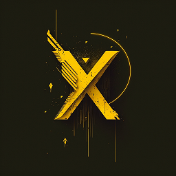

<!-- Improved compatibility of back to top link: See: https://github.com/othneildrew/Best-README-Template/pull/73 -->

[![Contributors][contributors-shield]][contributors-url]
[![Forks][forks-shield]][forks-url]
[![Stargazers][stars-shield]][stars-url]
[![Issues][issues-shield]][issues-url]
[![Discord][discord-shield]][discord-url]
[![MIT License][license-shield]][license-url]

<!-- PROJECT LOGO -->
 

  <a href="https://github.com/ZelionGG/XIV_Databar-Continued">
    <kbd></kbd>
  </a>

  <h3 align="center">XIV_Databar Continued</h3>

  

    A databar addon for World of Warcraft (Retail and Classic)
     
     
    <a href="https://github.com/ZelionGG/XIV_Databar-Continued/issues">Report Bug</a>
    ·
    <a href="https://github.com/ZelionGG/XIV_Databar-Continued/issues">Request Feature</a>
  

<!-- TABLE OF CONTENTS -->

  
Table of Contents

  <ol>
    <li>
        <a href="#about-the-project">About The Project</a>
        <ul>
            <li><a href="#built-with">Built With</a></li>
        </ul>
    </li>
    <li><a href="#slash-commands">Slash Commands</a></li>
    <li><a href="#modules">Modules</a></li>
    <li><a href="#features">Features</a></li>
    <li><a href="#roadmap">Roadmap</a></li>
    <li><a href="#credits">Credits</a></li>
    <li><a href="#localization">Localization</a></li>
    <li><a href="#contributing">Contributing</a></li>
    <li><a href="#license">License</a></li>
  </ol>

<!-- ABOUT THE PROJECT -->
## About The Project

[![XIVScreenshot][xiv-screenshot]](https://www.curseforge.com/wow/addons/xiv_databar-continued)

Pursuing the work of MilleXIV, [Vicious-wow](https://github.com/Vicious-wow/XIV_Databar) and [Kozoaku](https://github.com/Kozoaku/XIV_Databar).

A reworking of [SX_Databar by saxitoxin](https://www.wowinterface.com/downloads/info23745-SX_DataBar.html).

(<a href="#readme-top">back to top</a>)

### Built With

This section should list any major frameworks/libraries used to bootstrap your project. Leave any add-ons/plugins for the acknowledgements section. Here are a few examples.

* [![Lua][Lua]][Lua-url]

(<a href="#readme-top">back to top</a>)

## Slash Commands
* __/xivc__ or __/xivbar__ or __/xbc__ - shows/hides the GUI

(<a href="#readme-top">back to top</a>)

## Modules

- Micromenu
- Durability - With iLvl display
- Volume (Master)
- Talent - With spec and loot spec swapping on left/right click
- Clock
- Tradeskills
- Currency - With a mode for XP Bar when below level cap
- System
- Gold
- Travel - Right click the left hearth to choose an alternate transport method

(<a href="#readme-top">back to top</a>)

## Features

- In-Game Config
- Full profile support
- LibSharedMedia support

(<a href="#readme-top">back to top</a>)

## Roadmap

See the [open issues](https://github.com/ZelionGG/XIV_Databar-Continued/issues) for a full list of proposed features (and known issues).

(<a href="#readme-top">back to top</a>)

## Credits

- [https://www.wowinterface.com/downloads/info23745-SX_DataBar.html](saxitoxin) for the SX_Databar AddOn
- u/sammojo for the idea, textures and the description of the bar
- u/keyboardturn for updated spec icons
- MilleXIV for reviving the project and code refactoring

(<a href="#readme-top">back to top</a>)

## Localization

- PhatsoTGT - German Localization
- Amanthuul - Russian Localization
- Yaoenqi - Chinese Localization
- [class2u](https://github.com/class2u) - Chinese (Taiwan) Localization

__I am actually looking for people that want to help with localization of XIV_Databar Continued, don't hesitate to check [#10](https://github.com/ZelionGG/XIV_Databar-Continued/issues/10) and to contact me on [X (Twitter)](https://twitter.com/ZelionGG)__ 

(<a href="#readme-top">back to top</a>)

<!-- CONTRIBUTING -->
## Contributing

Contributions are what make the open source community such an amazing place to learn, inspire, and create. Any contributions you make are **greatly appreciated**.

If you have a suggestion that would make this better, please fork the repo and create a pull request. You can also simply open an issue with the tag "enhancement".

1. Fork the Project
2. Create your Feature Branch (`git checkout -b feature/AmazingFeature`)
3. Commit your Changes (`git commit -m 'Add some AmazingFeature'`)
4. Push to the Branch (`git push origin feature/AmazingFeature`)
5. Open a Pull Request

**PLEASE DON'T FORGET TO PUT THE VERSION OF THE GAME (RETAIL, WOTLK CLASSIC, VANILLA CLASSIC, ...) IN YOUR ISSUE** 

(<a href="#readme-top">back to top</a>)

<!-- LICENSE -->
## License

Distributed under the GPL-3.0 License. See `LICENSE` for more information.

(<a href="#readme-top">back to top</a>)

[contributors-shield]: https://img.shields.io/github/contributors/ZelionGG/XIV_Databar-Continued.svg?style=for-the-badge
[contributors-url]: https://github.com/ZelionGG/XIV_Databar-Continued/graphs/contributors
[forks-shield]: https://img.shields.io/github/forks/ZelionGG/XIV_Databar-Continued.svg?style=for-the-badge
[forks-url]: https://github.com/ZelionGG/XIV_Databar-Continued/network/members
[stars-shield]: https://img.shields.io/github/stars/ZelionGG/XIV_Databar-Continued.svg?style=for-the-badge
[stars-url]: https://github.com/ZelionGG/XIV_Databar-Continued/stargazers
[issues-shield]: https://img.shields.io/github/issues/ZelionGG/XIV_Databar-Continued.svg?style=for-the-badge
[issues-url]: https://github.com/ZelionGG/XIV_Databar-Continued/issues
[discord-shield]: https://img.shields.io/badge/Discord-7289DA?style=for-the-badge&logo=discord&logoColor=white
[discord-url]: https://discord.gg/g7JZNGSU32
[license-shield]: https://img.shields.io/github/license/ZelionGG/XIV_Databar-Continued.svg?style=for-the-badge
[license-url]: https://github.com/ZelionGG/XIV_Databar-Continued/blob/master/LICENSE.txt
[xiv-screenshot]: https://i.ibb.co/k5r5mCg/xiv-databar-continued.png
[Lua]: https://img.shields.io/badge/lua-000000?style=for-the-badge&logo=lua&logoColor=white
[Lua-url]: https://www.lua.org/
